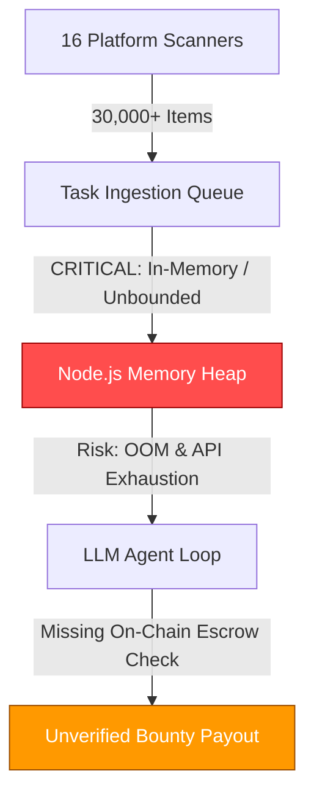

# 🛡️ AgentClaw Architecture Audit: Principal Systems Engineer Report

**Auditor Profile**: 40+ Years Systems Engineering, Distributed Systems, Fintech & Algorithmic Revenue Automation Architecture.  
**Target Codebase**: AgentClaw (CashClaw Engine) v0.1.0  
**Scope**: End-to-End System Reliability, Financial Security, Rate Limits, State Persistence, and Self-Evolution Safety.

---

## Executive Summary

AgentClaw is a promising autonomous agent framework designed to scan multi-platform gig feeds and execute tasks. However, operating an autonomous revenue-generating agent in production requires **bulletproof fault tolerance**, **strict compute budget control**, and **financial validation**. 

The current system has **5 major structural loopholes** that must be addressed to ensure sustainable production operations and real financial returns.

---

## 🔍 Structural Loopholes & Architectural Recommendations

### 1. ⚠️ In-Memory Task Queue & Ephemeral State Vulnerability
*   **The Issue**: `inMemoryTasks` lives inside Node.js heap memory. Render container restarts (or auto-deployments) wipe the active task queue. Furthermore, local JSON state (`~/.cashclaw/survival.json`) in standard cloud instances resets upon container redeployment unless attached to a persistent volume.
*   **Production Fix**:
    *   Migrate task state from in-memory arrays to a lightweight persistent store (e.g., **Redis** or **SQLite / PostgreSQL**).
    *   Store survival state and task progress with transactional integrity.

---

### 2. 🌊 Unbounded Task Ingestion & Memory Heap Overload
*   **The Issue**: Pushing 30,000+ discovered bounty items directly into `inMemoryTasks` will cause:
    1.  **Memory Heap Exhaustion**: High memory consumption causing Node.js process crashes (`ERR_OUT_OF_MEMORY`).
    2.  **LLM Quota Burning**: Unfiltered execution on low-quality/spam bounties wastes Gemini/Claude token allowances on $0.01 micro-tasks.
*   **Production Fix**:
    *   **Priority Queue & Throttling**: Cap `inMemoryTasks` queue depth (e.g., maximum 50 active items).
    *   **Value & Quality Filter**: Ingest only tasks exceeding a minimum reward threshold (e.g., ≥ $20 USD) with high relevance scores.

---

### 3. 💳 Missing On-Chain Escrow Verification (Fintech Validation)
*   **The Issue**: Scraped Web3 bounties (from Reddit, Bitcointalk, or GitHub) may represent unpaid, fraudulent, or expired requests. Spending LLM compute on bounties without verifying locked funds results in net negative compute ROI.
*   **Production Fix**:
    *   Implement an **On-Chain Escrow Verification Guard**: Before allocating LLM execution time to Web3/Gitcoin bounties, check smart contract balances on Ethereum/Solana/Base via RPC nodes to ensure funds are locked in escrow.

---

### 4. ⚡ Scanner Rate Limits & HTTP 429 Backoff Strategy
*   **The Issue**: Polling 16 platforms in parallel (`Promise.allSettled`) every few minutes without exponential backoff or proxy rotation will trigger IP blocks and `429 Too Many Requests` status codes from GitHub, Reddit, and Hacker News APIs.
*   **Production Fix**:
    *   Implement **Adaptive Polling Rates** and **Exponential Backoff with Jitter**.
    *   Use GitHub personal access tokens (`GITHUB_TOKEN`) for authenticated higher rate limits (5,000 requests/hr vs 60/hr unauthenticated).

---

### 5. 🧠 Self-Improvement Code Mutation Boundaries
*   **The Issue**: Autonomous self-improvement systems must be bounded by strict validation checks to prevent LLM hallucinations from introducing breaking runtime syntax or invalid imports into production code.
*   **Production Fix**:
    *   Enforce a **Compilation & Sandbox Test Gate**: Self-generated code changes must pass `tsup` build validation and unit tests before applying to the main execution branch.

---

## 🛠️ Recommended Action Plan

| Priority | Component | Mitigation Action | Target File |
| :--- | :--- | :--- | :--- |
| **P0** | Task Queue | Implement Throttling & Priority Filtering (Max 50 items, ≥ $10) | `src/listeners/categoryA.ts` |
| **P1** | Rate Limiting | Add GitHub Token support & Exponential Backoff on 429s | `src/listeners/categoryA.ts` |
| **P2** | Escrow Check | Integrate RPC Smart Contract Escrow Verification | `src/tools/marketplace.ts` |
| **P3** | Persistence | Store `survival.json` and tasks in SQLite / Redis | `src/memory/survival.ts` |

